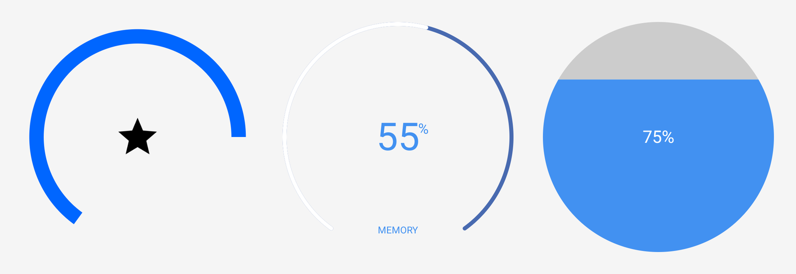
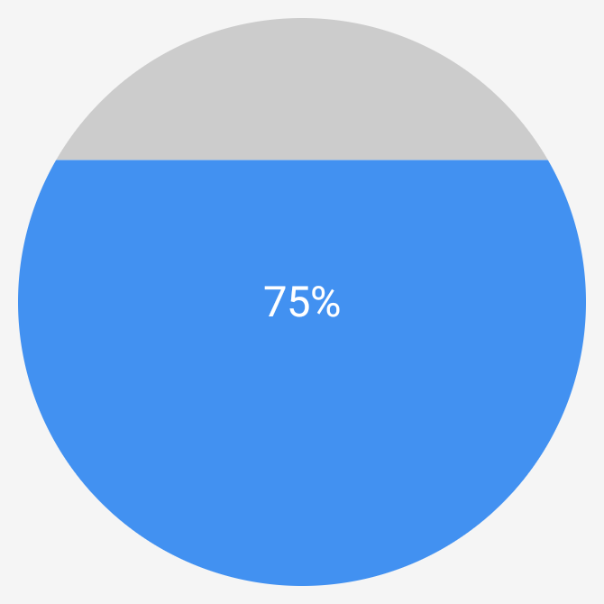
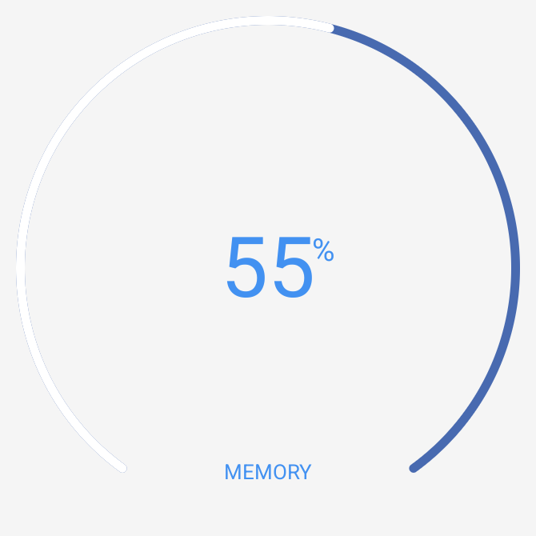

[](https://android-arsenal.com/details/1/1130)
[](https://jitpack.io/#happydog-intj/CircleProgress)

inspired from
[https://github.com/daimajia/NumberProgressBar](https://github.com/daimajia/NumberProgressBar)

and CleanMaster


### Demo



### Demo download [link](https://raw.githubusercontent.com/lzyzsd/CircleProgress/master/demos/example.apk)

### 3 kinds of progress view are provided, DonutProgress (supports inner drawables and VectorDrawables), CircleProgress, ArcProgress

## Usage

Add JitPack repository to your root `settings.gradle`:

```groovy
dependencyResolutionManagement {
    repositories {
        google()
        mavenCentral()
        maven { url 'https://jitpack.io' }
    }
}
```

### Gradle

```groovy
dependencies {
    implementation 'com.github.happydog-intj:CircleProgress:v2.0.0'
}
```

### Notice

please always use same width and height for progress views

DonutProgress

```xml
    <com.github.lzyzsd.circleprogress.DonutProgress
        android:layout_marginLeft="50dp"
        android:id="@+id/donut_progress"
        android:layout_width="wrap_content"
        android:layout_height="wrap_content"
        custom:donut_progress="30"/>
```

```xml
    <com.github.lzyzsd.circleprogress.DonutProgress
        android:layout_marginLeft="50dp"
        android:id="@+id/donut_progress"
        android:layout_width="wrap_content"
        android:layout_height="wrap_content"
        custom:donut_finished_color="#0066FF"
        custom:donut_finished_stroke_width="15dp"
        custom:donut_inner_drawable="@drawable/ic_vector_star_black_48dp"
        custom:donut_show_text="false"
        custom:donut_unfinished_color="#f5f5f5"
        custom:donut_unfinished_stroke_width="15dp"/>
```


attrs for DonutProgress

```xml
    <declare-styleable name="DonutProgress">
        <attr name="donut_progress" format="integer"/>
        <attr name="donut_max" format="integer"/>
        <attr name="donut_unfinished_color" format="color"/>
        <attr name="donut_finished_color" format="color"/>
        <attr name="donut_finished_stroke_width" format="dimension"/>
        <attr name="donut_unfinished_stroke_width" format="dimension"/>
        <attr name="donut_text_size" format="dimension"/>
        <attr name="donut_text_color" format="color"/>
        <attr name="donut_text" format="string"/>
        <attr name="donut_prefix_text" format="string"/>
        <attr name="donut_suffix_text" format="string"/>
        <attr name="donut_background_color" format="color"/>
    </declare-styleable>
```

CircleProgress

```xml
    <com.github.lzyzsd.circleprogress.CircleProgress
        android:id="@+id/circle_progress"
        android:layout_marginLeft="50dp"
        android:layout_width="100dp"
        android:layout_height="100dp"
        custom:circle_progress="20"/>
```



attrs for CircleProgress

```xml
    <declare-styleable name="CircleProgress">
        <attr name="circle_progress" format="integer"/>
        <attr name="circle_max" format="integer"/>
        <attr name="circle_unfinished_color" format="color"/>
        <attr name="circle_finished_color" format="color"/>
        <attr name="circle_text_size" format="dimension"/>
        <attr name="circle_text_color" format="color"/>
        <attr name="circle_prefix_text" format="string"/>
        <attr name="circle_suffix_text" format="string"/>
    </declare-styleable>
```

ArcProgress

```xml
    <com.github.lzyzsd.circleprogress.ArcProgress
        android:id="@+id/arc_progress"
        android:background="#214193"
        android:layout_marginLeft="50dp"
        android:layout_width="100dp"
        android:layout_height="100dp"
        custom:arc_progress="55"
        custom:arc_bottom_text="MEMORY"/>
```



attrs for ArchProgress

```xml
    <declare-styleable name="ArcProgress">
        <attr name="arc_progress" format="integer"/>
        <attr name="arc_angle" format="float"/>
        <attr name="arc_stroke_width" format="dimension"/>
        <attr name="arc_max" format="integer"/>
        <attr name="arc_unfinished_color" format="color"/>
        <attr name="arc_finished_color" format="color"/>
        <attr name="arc_text_size" format="dimension"/>
        <attr name="arc_text_color" format="color"/>
        <attr name="arc_suffix_text" format="string"/>
        <attr name="arc_suffix_text_size" format="dimension"/>
        <attr name="arc_suffix_text_padding" format="dimension"/>
        <attr name="arc_bottom_text" format="string"/>
        <attr name="arc_bottom_text_size" format="dimension"/>
    </declare-styleable>
```

donut_inner_drawable

support add a drawable/vectorDrawable to the center

donut_show_text

show or hide bottom text

### Build

run `./gradlew assembleDebug` (Mac/Linux)

or

run `gradlew.bat assembleDebug` (Windows)

### Changes

version 2.0.0:
- Migrate to AndroidX (minSdk raised to 21)
- Upgrade to AGP 8.x / Gradle 8.x / compileSdk 35
- Replace ArcProgress busy-loop animation with ValueAnimator
- Change CircleProgress progress type from int to float
- Add accessibility support (screen reader) to all views
- Fix Paint object recreation on every invalidate
- Move DonutProgress RectF calculation from onDraw to onSizeChanged
- Fix duplicate attribute reads and wrong Bundle type in DonutProgress
- Publish via JitPack (maven-publish)

version 1.1.0: add bottom text to DonutProgressView

DO WHAT THE FUCK YOU WANT TO PUBLIC LICENSE
Version 2, December 2004

Copyright (C) 2014 Bruce Lee <bruceinpeking#gmail.com>

Everyone is permitted to copy and distribute verbatim or modified
copies of this license document, and changing it is allowed as long
as the name is changed.

            DO WHAT THE FUCK YOU WANT TO PUBLIC LICENSE


TERMS AND CONDITIONS FOR COPYING, DISTRIBUTION AND MODIFICATION

0. You just DO WHAT THE FUCK YOU WANT TO.
